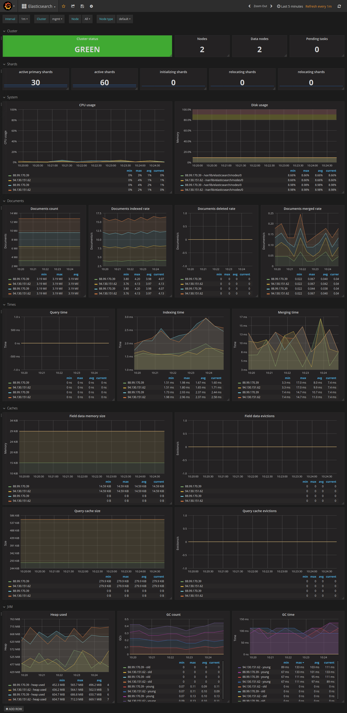

# Scalefastr Grafana Dashboards for Prometheus 2.0 and Grafana

While bringing up Prometheus 2.0 for [Scalefastr](https://www.scalefastr.io)
(our Cassandra and Elasticsearch managed hosting platform) we noticed that a lot
of the Grafana dashboards for Cassandra, Elasticsearch, etc worked acceptably on
Prometheus 1.x but did not migrate cleanly to 2.x.

Additionally, we had some problems with unified labels across dashboards as well
as the fact that many dashboards were not well documented.

We ended up having to reverse engineer what the original dashboard author meant
as well as trying to reproduce their Prometheus configuration (which wasn't always clear).  

To help others migrate to Prometheus 2.0 (as well as have functioning dashboards)
we thought it would be valuable to have a "known good" configuration of both
dashboards and Prometheus configuration that they would work from.

# Screenshots

# Credits       

While developing these we didn't track all the original authors of the dashboards.

At the time we weren't planning on creating this project and just assumed that
these would be internal dashboards. If we didn't give you credit please let us
know and we will rectify. It's our plan to make sure everyone gets credit

## Cassability.

The Cassandra metrics are based on Cassability: 

https://github.com/outbrain/Cassibility